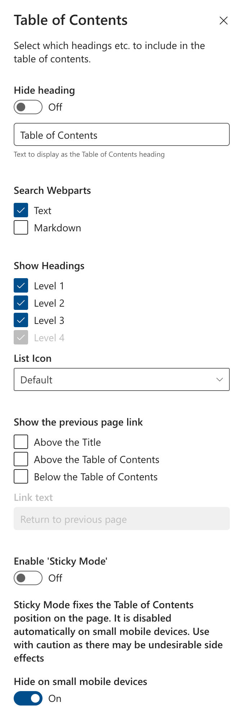

# Table of Contents Web Part

## Summary
This SharePoint Framework web part displays a table of contents for the current page and is based on [Dzmitry Rogozhny's](https://github.com/dmitryrogozhny) excellent [Table of Contents](https://github.com/dmitryrogozhny/sharepoint-lab/blob/master/table-of-contents/). I haven't forked the code as it was originally for an internal project and I didn't want to fork the entire repositry, just this sub folder. There's probably some way in GIT to fork just a sub folder, but I don't know how.

The web part provides the following properties:
- `Hide heading`&thinsp;&mdash;&thinsp;whether to show the main heading.
- `Search Webparts`&thinsp;&mdash;&thinsp; which webparts to search for headings.
- `Show Headings Level 1`&thinsp;&mdash;&thinsp;whether to show the first level of headings.
- `Show Headings Level 2`&thinsp;&mdash;&thinsp;whether to show second level of headings.
- `Show Headings Level 3`&thinsp;&mdash;&thinsp;whether to show third level of headings.
- `Show Headings Level 4`&thinsp;&mdash;&thinsp;whether to show fourth level of headings. Only available for Markdown webpart
- `List Icon` &thinsp;&mdash;&thinsp; change the default icon that is shown on the links
- `Show the previous page link`&thinsp;&mdash;&thinsp;whether to show a link to the previous page in the location seclected.
If used in conjunction with 'Hide heading', you could use just one location to have a basic 'Return to previous page' link. 
- `Enable 'Sticky Mode'`&thinsp;&mdash;&thinsp;Makes the table of contents 'stick' to where it was on the screen when a long page is scrolled*.
- `Hide on small mobile devices`&thinsp;&mdash;&thinsp;whether to hide the web part on small screens.

*This mode will not work correctly on the local workbench, only the live site. It should also be used with caution as it works by manipulating Microsoft's styles on the containing element, so it may stop working if Microsoft change their code, you have been warned! When used with this mode, it is best to place the Table of Contents in a 'vertical section' as this covers the full length of a page.

## Minimal Path to Awesome
### Pre-built package
You can grab the pre-built package ready for deployment from [./package/table-of-contents.sppkg](https://github.com/RedEchidnaUK/Table-of-Contents/blob/master/package/table-of-contents.sppkg).

Here's how to deploy the web part to the site collection's app catalog:

### Local testing
- Clone this repository
- In the command line run:
  - `npm install`
  - `gulp serve`

### Deploy
- `gulp clean`
- `gulp bundle --ship`
- `gulp package-solution --ship`
- Upload .sppkg file from sharepoint\solution to your tenant App Catalog
  - E.g.: https://`tenant`.sharepoint.com/sites/AppCatalog/AppCatalog
- Add the web part to a site collection, and test it on a page
